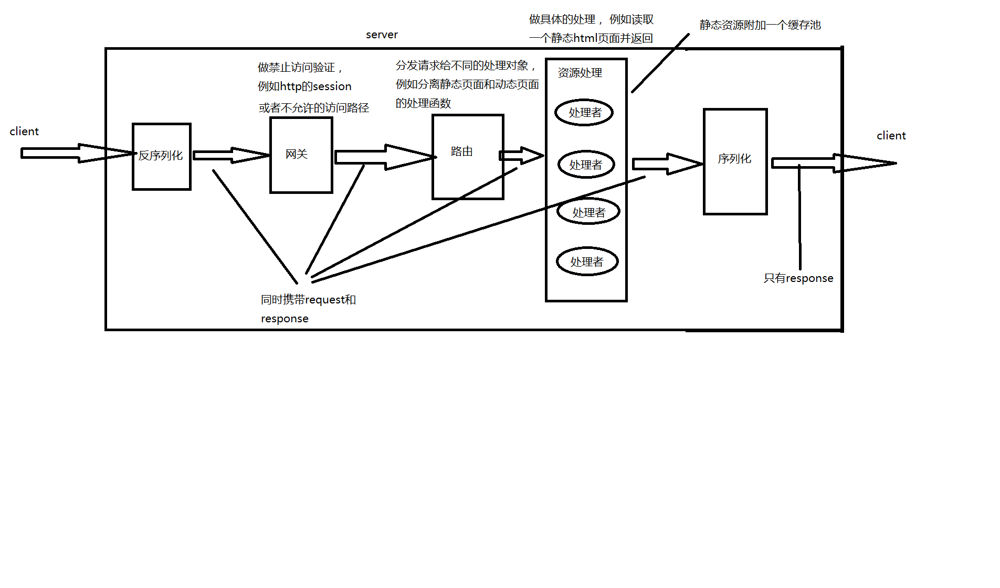
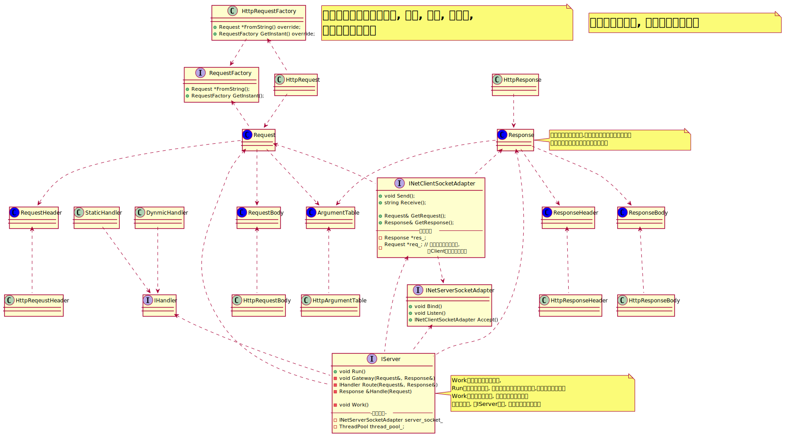

# Server的结构说明

Server大体结构如下如所示

上图是一个http服务器的例子. 

但是IServer设计的更加通用.

服务端的操作总体分成5步, 

1. 对请求的反序列化, 形成一个请求对象.
1. 对请求的网关验证, 过滤掉不合法的请求.
1. 对请求的路由, 将请求转发到具体的服务处理程序上进行处理.
1. 服务处理.
1. 响应的反序列化, 然后通过网络发送出去.

> ### 可能的优化方法
> 1. 将反序列化和序列化组织成一个对象, 因为这两个操作本身就是强耦合的.
> 1. 允许处理类远程调用, 来将不同的请求分布到不同的服务器上进行处理.(但是在大并发的情况下, 网关和路由是否会成为一个瓶颈, 是一个问题)

# UML类图

